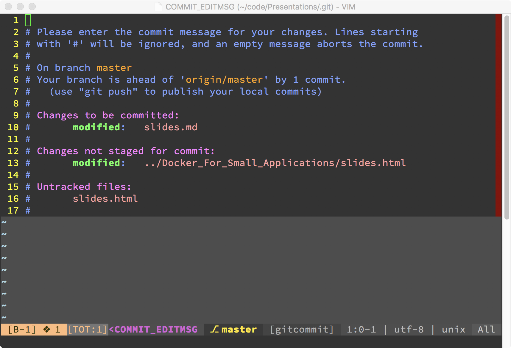

layout: true
<header>
  <p class="left">Effingham Software Developer Group</p>
  <p class="right">@rebelwebdev</p>
</header>

---

class: title, middle, center
# Git Basics
## Ryan Condron

---

class: middle, center
# Goal
## To understand the basic commands of git, and how to integrate it into your workflow.

---

# What is it
- Git is a tool to keep track of every change made to your code
- Git is a distributed source control (unlike TFVC - Team Foundation Version
  Control - which is centralized)
- Git itself is not a issue tracker, the tools build on top of git are issue
  trackers (i.e. Github, Gitlab, TFS)

---

# Why?
- Git provides tools to make working in a team easier compared to working
  without.
- Keep a history of changes
- Versioning (release points)
- Code Reviews

---

# Intalling Git
- Windows: Installer Available at: https://git-scm.com/download/win
- Linux: Available via your favorite package manager
- MacOs: Install using MacPorts, Homebrew, https://git-scm.com
- BSD: Install using package manager or port

---

# Git Setup
- Windows will need extra setup for using Git over SSH
- Setup global config options

```sh
# Username
git config user.name "Ryan Condron"
```

```sh
# E-Mail Address
git config user.email "rebelwebdevelopment@gmail.com"
```

```sh
# Set you editor
git config core.editor vim
```

---

# Initialize Your Project

- Open Terminal / Command Window and Prepare for your first commit

```sh
# change directory to your project
cd /your/project

# initialize git
git init
```

---

# Preparing Your First Commit

- Check for secrets (i.e. API Keys, encryption keys, passwords, etc.)
- Create .gitignore file
  - ignores files and directories that should not be changed
  - Starter Templates: https://github.com/github/gitignore
  - Should be in every project
- Run git status to make sure files and directories that need to be ignored are
  ignored (i.e. secrets)

```sh
git init
```

---

# Things to add to Source Control

- Code
- Documentation
- Database Schema
- Automated Tests
- Photoshop Files

---

# Things NOT to Add to Source Control

- Secrets - anything that could comprimise the end product
  - Password
  - API Keys
  - Encryption Keys
- Log Files
- Dependencies
- Build Artifacts
- Reports
- Uploaded Files

---

# Your First Commit

```sh
# Add Files
git add --all
# Commit Changes
git commit -m "Initial Commit"
```

---

# Staging Files

Before you can commit you will need to stage files you want to commit. This is
performed by using the add subcommand followed by the directory or filename with
the full path. If the ‘--all’ switch is used it will stage all changed and new
files.

```sh
# Stage a Single File
git add docs/setup.md
# Stage all files
git add --all
```

---

# Git Commit

This can be performed a couple different ways with the ‘-m’ switch which commits
with a basic message and without which will open the default editor to edit the
commit message, used for more detailed messages.

```sh
git add --all
git status
git commit -m "My Message"
```

---

# Git Commit Editor



---

# Good vs Bad Commit Messages

- Good
  - changed setup docs to include dependencies
  - fixed errors
- Bad
  - Changed Setup docs
  - fixed depricated errors

---

# Git History

- Each time you make a commit there is a entry in your history. You can view
  your commit history. Your history keeps track of changes you have made to your
  project all the way back to the initial commit. You can view history in the
  web interface of your remote or using git log.
- Work In Small Commits, to make the log more meaningful

```sh
git log
```

---

# Removing Files
- History will show removed code as well as added code.
- Keep in mind that when you remove a file, code, or that password you forgot to
  ignore, IT WILL STILL BE IN HISTORY AND VISIBLE!!!
- BFG Repo Cleaner, removes files from old commits easily

---

# Setup a Remote Repository to Track Changes
- After committing you should set up a remote to manage changes.
- Several options exist for hosting for little to no cost.
  - https://github.com (free public repos, paid private repos)
  - https://gitlab.com (free repos public & private, pay for premium features)
  - https://www.visualstudio.com/team-services/ (free for small teams)
  - https://bitbucket.com (free for small teams)

```sh
git remote add origin https://github.com/username/repo.git
```

---

# Pushing Changes to Remote

Once your remote is setup you can push your local changes to it using the push
subcommand followed by the remote name (central repository) and branch.

```sh
git push origin master
```

---

# Pulling Changes From Remote

Pulling allows you to bring changes down from the remote to your local machine.
Just like pushing you can pull from a remote to your local repository. It will
pull changes from the remote branch to the current working branch on your local
machine.

```sh
git pull origin master
```

---

# Branching

Branching allows you to make code changes in an isolated environment, so you
won’t affect your production code base. This allow you to push bug fixes without
deploying partially built new features or waiting until those features are
complete.

- Goal is to keep master (main branch) stable
- Make changes in branches and merges changes into master once complete.
- Freedom to experiment

```sh
git branch experiment
git checkout -b experiment
```

---

# Merging

So we made changes in a branch and are ready to put those changes in production.
We need to merge. Most of the time you will merge using your remote repository’s
web interface. The exception would be merge conflicts. To merge using the
command line interface you first checkout out the target branch and use the
merge subcommand and passing the name of the merging branch.

```sh
# Checkout Master Branch
git checkout
# Merge Changes
git merge experience
```

---

# Merge Conflicts

Merge conflicts are when the changes made in the merging branch conflict with
changes made in the target branch since the merging branch was created. In this
case you/your team will need to go through the conflicts and decide how to move
forward.

---

# Resolving Merge Conflicts

Most git hosting services will guide you through the process. You will have a
list of conflicts (sometimes there is more than one) and you will need to go to
each affected file and decide which branches version to keep, which to remove,
sometimes a mix between both.

If doing on a local machine my favorite tool is the merge-conflicts plugin for
Atom. It will give you a list and you pick and choose the changes you want or a
combination of both.

---

# Tagging

When you deploying to production you should generate a tag to show deploy points
in your code base. A tag is a name for a specific commit. This works similar to
git commit. It is recommend that your tags name are a semantic version number.

```git
git tag -a '0.0.1' -m '0.0.1'
```

---

# Semantic Versioning

Semantic Versioning is a standardized way to version software. It is three set
of numbers separated by (.) - 5.4.0

- The first number is a major version (5)
- The second number is the minor version (4)
- The third number is the patch number (0)

---

# Forking

Most remote servers allow you to fork or copy a repository to a new location
with a new name. The main use of this is when you want to work with a project
that isn’t yours and you want to make a change i.e. a bug fix or a new feature.
You can do a pull request to allow the forked repository to pull in your change.

---

# GUI Tools

- https://www.gitkraken.com/pro (cost for commercial use)
- https://www.sourcetreeapp.com/ (free)
- Many editors have git tools built in!
